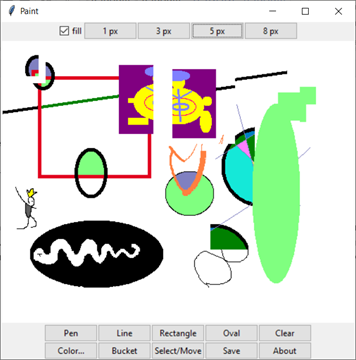

Кроссплатформенный графический редактор, позволяющий рисовать примитивы, проводить их закрашивание, перемещение. Результат работы программы позволяет возможность сохранять в общепринятый графический формат.

Программа написана на Python 3 с использованием библиотек Tkinter для интерфейса и Pillow для обработки изображений.

Описание интерфейса:
* Верхняя панель:
  + Выбор размера кисти/толщины линий фигур;
  + Кнопка Fill, отвечающая за заливку рисуемых фигур;
* Область для рисования фиксированного размера;
* Нижняя панель:
  + Карандаш;
  + Примитивы (линия, прямоугольник, эллипс);
  + Очищение области рисования;
  + Выбор цвета;
  + Заливка;
  + Выбор фрагмента и затем его перемещение;
  + Сохранение в формате PNG;
  + Окно «About»;

